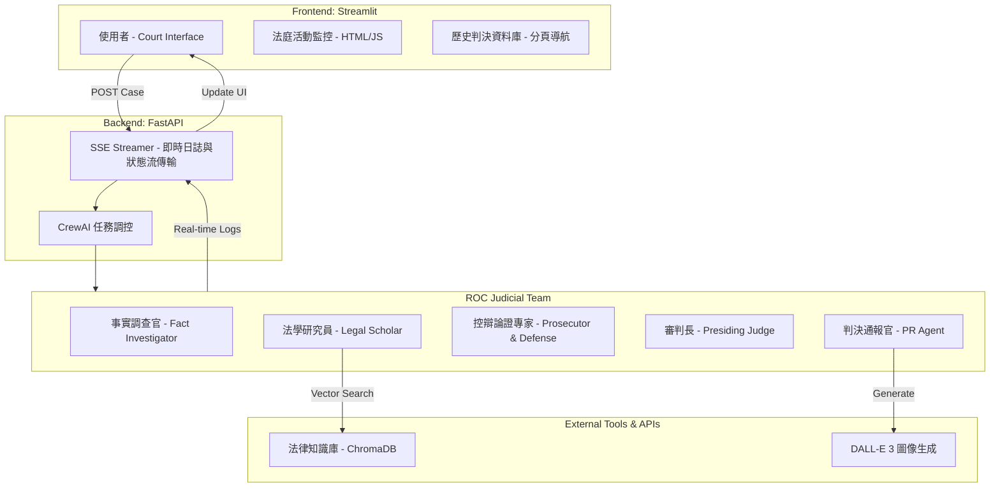
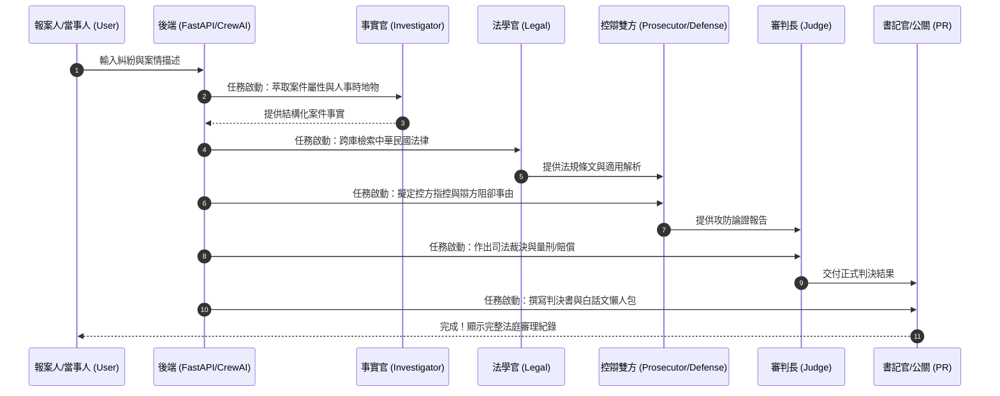
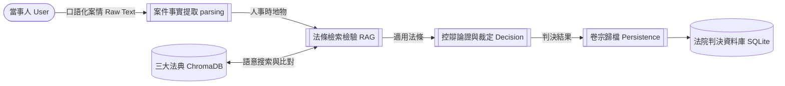
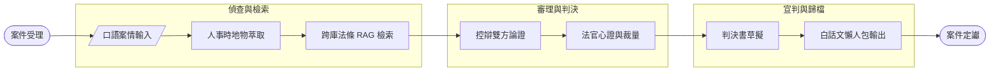

# ⚖️ 中華民國 AI 模擬法庭與判決分析系統 v3.0.0
# ROC AI Mock Court & Judgment Analysis System v3.0.0

[](https://www.python.org/)
[](https://www.crewai.com/)
[](https://streamlit.io/)
[](https://fastapi.tiangolo.com/)

---

## 📖 專案介紹 | Introduction

### 🇹🇼 中文 (Traditional Chinese)
本專案是一套基於 **Multi-Agent (多智能體)** 協作技術開發的「AI 模擬法庭與判決分析系統」。系統模擬了現代化的法庭審理流程，透過五位具備司法專業背景的 AI 代理人，將複雜或口語化的「糾紛與案情描述」自動轉化為包含：事實調查、法條檢索、控辯攻防、有罪/賠償判定、以及最終判決書與白話摘要產出的全方位司法分析報告。

### 🇺🇸 English
This project is an automated "ROC AI Mock Court & Judgment Analysis System" built on **Multi-Agent** collaborative technology. It simulates a modern judicial trial process. Through five specialized AI legal agents, it automatically transforms vague verbal case descriptions or indictments into comprehensive judicial analyses, including: factual investigation, legal statute retrieval, prosecution/defense argumentation, verdict determination, and the generation of a formal judgment document with a plain-language summary.

---

## 🏗️ 系統架構圖 | System Architecture



---

## 🛰️ 邏輯時序圖 | Logic Sequence Diagram



---

## 📊 資料流圖 (DFD) | Data Flow Diagram



---

## 🔄 業務流程圖 | Business Process Diagram



---

## ✨ 核心特色 | Key Features

*   **👨‍⚖️ 多智能體司法協作 (Multi-Agent Swarm)**：採用五位專屬司法 AI 角色（調查官、研究員、控辯專家、法官、書記官），模擬真實法庭的合議與攻防邏輯。
*   **📚 跨庫法律 RAG 引擎 (Multi-Collection RAG)**：內建《中華民國憲法》、《中華民國刑法》、《中華民國民法》，系統能依據案件動態切換或跨庫搜尋適用法條。
*   **⚖️ 深度控辯模擬 (Adversarial Reasoning)**：內建防禦性推理機制，自動為被告尋找「阻卻違法事由」或「減輕責任事由」，確保判決不偏頗。
*   **🕹️ 全即時審理面板 (Live Court Room)**：前端採用莊重的法院設計風格，透過 SSE 技術實現各 AI 法官、律師思考過程的毫秒級同步顯示。
*   **🎬 歷史卷宗重播 (Case Replay)**：新增歷史判決記錄還原功能！可選取歷史案件，以 0.5 秒/條的速度重播法庭攻防過程，提供 Log 時間軸以及各 Agent 氣泡思考過程。
*   **⚡ 高性能與防跑版機制**：
    *   **無縫 iframe 獨特鍵值定位**：重播組件使用動態 HTML 註解 Hash 機制，徹底避免 Streamlit widget ID 重複報錯。
    *   **高併發 SQLite WAL 模式**：讀寫分流與超時等待，避免 Web API 與前端元件多線程鎖死。
    *   **思考標籤攔截**：底層強制過濾開源模型的 `<think>` 或 `<|channel|>` 標籤，確保判決書格式純淨。

---

## 📁 目錄架構 | Directory Structure

```text
/
├── app.py                # Streamlit 前端法庭介面 (Port: 8501)
├── main.py               # FastAPI 後端路由與 CrewAI 調度器 (Port: 8000)
├── database.py           # SQLite 判決卷宗與會議日誌持久化 (WAL 併發模式)
├── start.sh              # 一鍵啟動指令碼 (自動管理背景 Port 占用)
├── stop.sh               # 一鍵停止指令碼 (優雅釋放 8000 與 8501 埠口)
├── agents/
│   └── response_crew.py  # 核心 Agent 司法行為與 Task 定義
├── tools/
│   ├── legal_kb_rag.py   # RAG 知識庫管理器 (支援多 Collection)
│   ├── legal_kb_tool.py  # AI Agent 調用之檢索工具
│   └── image_tool.py     # AI 圖片生成工具 (可選)
├── knowledge_base/       # 存放三大法典 Markdown 文本與 ChromaDB 向量索引
├── assets/               # 靜態視覺元件與生成圖片
└── requirements.txt      # Python 相依套件清單
```

---

## 🚀 快速開始 | Quick Start

### 1. 準備 `.env` 文件
在專案根目錄建立 `.env`，填入您的 LLM API 設定。
系統預設支援自定義的高端 LLM (如 vLLM/Ollama) 或一般雲端 API：
```env
# 核心大語言模型 API (必填)
GEMINI_API_KEY="your_api_key_here"

# (選項) 如果您使用自定義的開源 LLM，請填寫以下欄位：
DEFAULT_LLM_MODEL=""
DEFAULT_LLM_BASE_URL=""
```

### 2. 一鍵啟動與停止 (Local)
本專案已配置完整的管理腳本，無需手動管理多個終端機視窗：

*   **啟動系統**：
    ```bash
    bash start.sh
    ```
    啟動後會自動在背景啟動後端與前端，並開啟對應服務：
    *   **前端模擬法庭**: [http://localhost:8501](http://localhost:8501)
    *   **後端 API 文件**: [http://localhost:8000/docs](http://localhost:8000/docs)

*   **停止系統**：
    ```bash
    bash stop.sh
    ```
    此腳本將自動探測並強制終止佔用 Port `8000` 與 `8501` 的程序，確保系統乾淨關閉。

---

## 🏛️ 免責聲明 | Disclaimer
本系統生成的法律建議、判決書草案與攻防論點僅供**學術研究與 AI 邏輯推論技術展示參考**，**絕對不得直接作為正式法律諮詢或法院處分之依據**。如遇真實法律糾紛，請務必尋求合格執業律師之專業協助。

---
*© 2026 ROC AI Judicial Mock Court Team. Developed for Legal Tech Innovation.*
