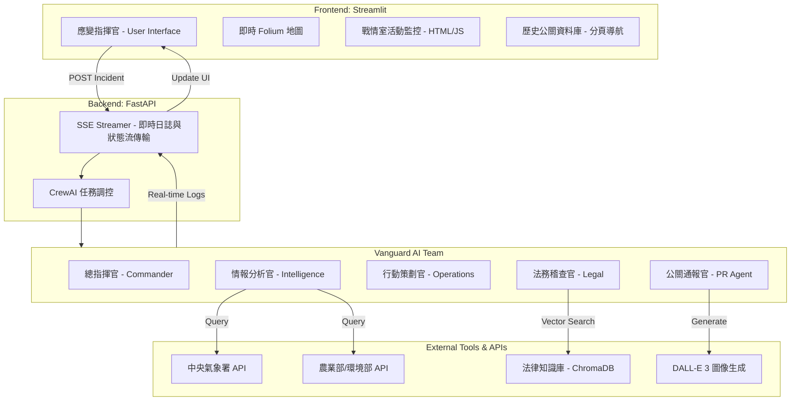
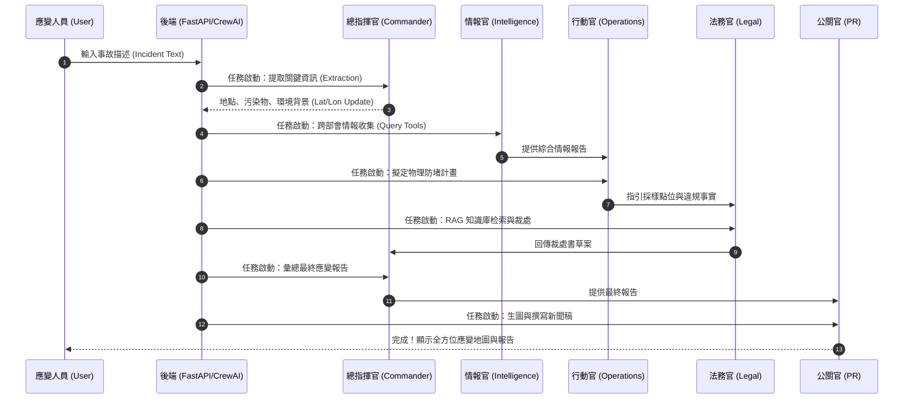
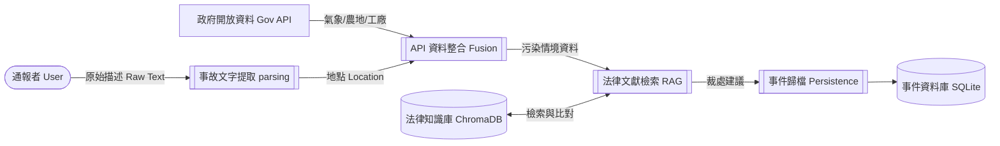
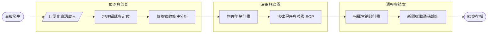

# 🌱 土壤污染 AI 應變指揮系統 v0.3.1 (Vanguard)
# Soil Pollution AI Emergency Response System v0.3.1 (Vanguard)

[](https://www.python.org/)
[](https://www.crewai.com/)
[](https://streamlit.io/)
[](https://fastapi.tiangolo.com/)

---

## 📖 專案介紹 | Introduction

### 🇹🇼 中文 (Traditional Chinese)
本專案是一套基於 **Multi-Agent (多智能體)** 協作技術開發的「土壤與環境污染事件自動化應變系統」。系統模擬了現代化的事故指揮中心（War Room），透過五位具備專業背景的 AI 代理人，將複雜的口語通報自動轉化為包含：天氣情資、農業損害評估、列管工廠溯源、法律裁處擬定、以及新聞通稿產出的全方位應變計畫。

### 🇺🇸 English
This project is an automated "Soil and Environmental Pollution Emergency Response System" built on **Multi-Agent** collaborative technology. It simulates a modern mission control center (War Room). Through five specialized AI agents, it automatically transforms vague verbal incident reports into comprehensive response plans, including: meteorological intelligence, agricultural damage assessment, industrial source tracing, legal enforcement drafting, and PR news generation.

---

## 🏗️ 系統架構圖 | System Architecture



---

## 🛰️ 邏輯時序圖 | Logic Sequence Diagram



---

## 📊 資料流圖 (DFD) | Data Flow Diagram



---

## 🔄 業務流程圖 | Business Process Diagram



---

## ✨ 核心特色 | Key Features

*   **🕵️ 多智能體協作 (Multi-Agent Swarm)**：採用五位專業化 AI 角色，模擬真實政府應變層級，而非單一對話機器人。
*   **📍 動態地理偵測 (Geo-Awareness)**：利用 LLM 強大的語意理解能力擷取地點，並即時於 Folium 地圖自動定位事故現場。
*   **📚 法律 RAG 知識庫 (Legal RAG)**：內建《土壤及地下水污染整治法》、《廢棄物清理法》等法規，系統能透過向量搜索自動生成「裁處書草案」。
*   **🕹️ 全即時監控面板 (Live War Room)**：前端採用 glassmorphism 設計風格，透過 SSE 技術實現 Agent 思考過程的毫秒級同步顯示。
*   **🎬 戰情會議重播 (Action Replay)**：新增歷史會議記錄還原功能！可選取歷史事件，以 0.5 秒/條的速度重播會議過程，提供動態地圖標註、Log 時間軸、以及各 Agent 氣泡思考過程。
*   **🖼️ AI 視覺預覽 (Visual PR)**：整合 DALL-E 技術，根據應變計畫自動生成事故模擬圖，快速同步各界認知。
*   **⚡ 高性能與防跑版機制**：
    *   **無縫 iframe 獨特鍵值定位**：重播組件使用動態 HTML 註解 Hash 機制，徹底避免 Streamlit widget ID 重複報錯。
    *   **Markdown 反轉義清洗**：歷史資料庫與公關新聞稿內建自動換行符（`\\n` ➡️ `\n`）解鎖功能，維持完美排版。
    *   **高併發 SQLite WAL 模式**：讀寫分流與超時等待，避免多線程鎖死。

---

## 📁 目錄架構 | Directory Structure

```text
/
├── app.py                # Streamlit 前端戰情室介面 (Port: 8501)
├── main.py               # FastAPI 後端路由與 CrewAI 調度器 (Port: 8000)
├── database.py           # SQLite 事件與會議日誌持久化 (WAL 併發模式)
├── start.sh              # 一鍵啟動指令碼 (自動管理背景 Port 占用)
├── stop.sh               # 一鍵停止指令碼 (優雅釋放 8000 與 8501 埠口)
├── agents/
│   └── response_crew.py  # 核心 Agent 行為與 Task 定義
├── tools/
│   ├── weather_api.py    # 中央氣象署工具
│   ├── agri_api.py       # 農業部土石流/農地工具
│   ├── econ_api.py       # 環境部/經濟部列管工廠工具
│   ├── legal_kb_tool.py  # 法律知識庫 RAG 工具
│   └── image_tool.py     # AI 圖片生成工具
├── knowledge_base/       # 存放法律 MD 文件與向量索引
├── assets/               # 靜態地圖 SVG 與生成圖片地圖
├── 容器化/               # Docker 容器化部署環境與配置檔
└── requirements.txt      # Python 相依套件清單
```

---

## 🚀 快速開始 | Quick Start

### 1. 準備 `.env` 文件
在專案根目錄建立 `.env`，填入以下 API Key：
```env
GEMINI_API_KEY="你的_Gemini_Key"
CWA_API_KEY="中央氣象署_Key"
MOENV_API_KEY="環境部_Key"
```

### 2. 一鍵啟動與停止 (Local)
本專案已配置完整的管理腳本，無需手動管理多個終端機視窗：

*   **啟動系統**：
    ```bash
    bash start.sh
    ```
    啟動後會自動在背景啟動後端與前端，並開啟對應服務：
    *   **前端戰情室**: [http://localhost:8501](http://localhost:8501)
    *   **後端 API 文件**: [http://localhost:8000/docs](http://localhost:8000/docs)

*   **停止系統**：
    ```bash
    bash stop.sh
    ```
    此腳本將自動探測並強制終止佔用 Port `8000` 與 `8501` 的舊程序，確保系統乾淨關閉。

---

## 🏛️ 免責聲明 | Disclaimer
本系統生成的法律建議、應變計畫與地理定位僅供學術研究與 AI 技術展示參考，**不得直接作為政府正式處分依據**。實際應變作業應以現場指揮官及專業技師判斷為準。

---
*© 2026 Vanguard AI Response Team. Developed with ❤️ for a Greener Tomorrow.*
